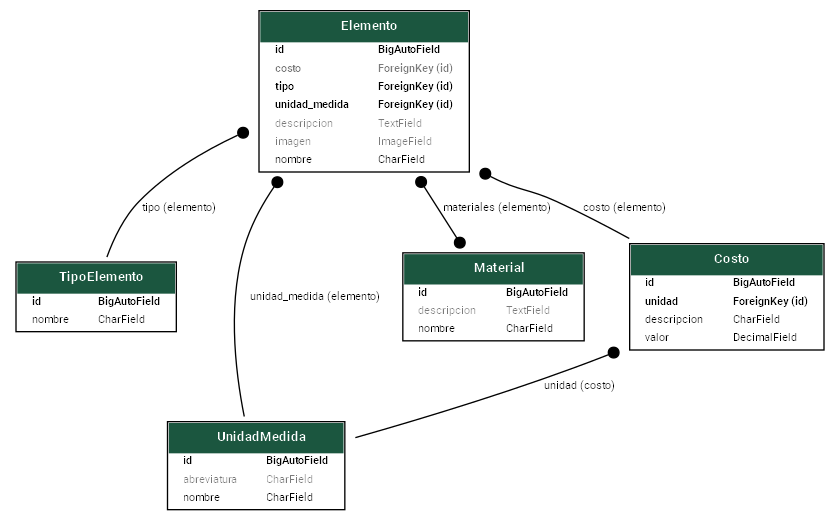

# PG2-Pract3
# RVT API

## Descripción

RVT es una API pública desarrollada en Django y Django REST Framework para la gestión de recursos de construcción: tipos de elementos, unidades de medida, materiales, costos y elementos. Permite consultar, crear, modificar y eliminar información relevante para la administración eficiente de recursos en proyectos de construcción.

---

## Instalación y configuración

### 1. Crear y activar el entorno virtual

En Windows:

```sh
python -m venv venv
venv\Scripts\activate
```

---
En Linux/Mac:
python3 -m venv venv
source venv/bin/activate

### 2. Crear proyecto Django
```sh
django-admin startproject MiApi
```
---
### 3. Crear aplicación Django
```sh
django-admin startapp RVT
```
### 4. Crear archivo requirements.txt
```sh
asgiref==3.8.1
Django==5.2.1
django-extensions==4.1
sqlparse==0.5.3
tzdata==2025.2
djangorestframework==3.16.0
```
### 5. Instalar dependencias
```sh
pip install -r [requirements.txt](http://_vscodecontentref_/0)
```
### 6. Configurar settings.py

En el archivo settings.py, agregar las aplicaciones necesarias a 
```sh
INSTALLED_APPS:
INSTALLED_APPS = [
    ...
    'RVT',
    'rest_framework',
    'django_extensions',
]
```

### 7. Migrar la base de datos
```sh
python [manage.py](http://_vscodecontentref_/1) makemigrations
python [manage.py](http://_vscodecontentref_/2) migrate
```
Diagrama de modelos
Instala Graphviz desde su página oficial para generar el diagrama de modelos:
# En Linux
sudo apt-get install graphviz
# En Windows, descarga el instalador desde la web oficial
```sh
python manage.py graph_models RVT -o rvt_models.png
```


### Ejecutar el servidor
```sh
python [manage.py](http://_vscodecontentref_/4) runserver
```
## Endpoints y Métodos Disponibles
Endpoint	Métodos	Descripción
/api/tipo-elemento/	GET, POST	Listar y crear tipos de elemento
/api/tipo-elemento/{id}/	GET, PUT, PATCH, DELETE	Detalle, actualizar o eliminar tipo de elemento
/api/unidad-medida/	GET, POST	Listar y crear unidades de medida
/api/unidad-medida/{id}/	GET, PUT, PATCH, DELETE	Detalle, actualizar o eliminar unidad de medida
/api/material/	GET, POST	Listar y crear materiales
/api/material/{id}/	GET, PUT, PATCH, DELETE	Detalle, actualizar o eliminar material
/api/costo/	GET, POST	Listar y crear costos
/api/costo/{id}/	GET, PUT, PATCH, DELETE	Detalle, actualizar o eliminar costo
/api/elemento/	GET, POST	Listar y crear elementos
/api/elemento/{id}/	GET, PUT, PATCH, DELETE	Detalle, actualizar o eliminar elemento

Ejemplo de Caso de Uso
Registrar y consultar un nuevo material de construcción
1. Crear un nuevo tipo de elemento
```sh
POST /api/tipo-elemento/

{
  "nombre": "Viga"
}

Respuesta:
{
  "id": 1,
  "nombre": "Viga"
}
```

2. Crear una unidad de medida
```sh
POST /api/unidad-medida/
{
  "nombre": "Metro"
}

Respuesta:
{
  "id": 1,
  "nombre": "Metro"
}
```
3. Crear un material
```sh
POST /api/material/
{
  "nombre": "Acero"
}
Respuesta:
{
  "id": 1,
  "nombre": "Acero"
}
```
4. Crear un costo
```sh
POST /api/costo/
{
  "valor": 150.0
}
Respuesta:
{
  "id": 1,
  "valor": 150.0
}
```
5. Crear un elemento
```sh
POST /api/elemento/
{
  "nombre": "Viga Principal",
  "tipo_elemento": 1,
  "unidad_medida": 1,
  "material": 1,
  "costo": 1
}
Respuesta:
{
  "id": 1,
  "nombre": "Viga Principal",
  "tipo_elemento": 1,
  "unidad_medida": 1,
  "material": 1,
  "costo": 1
}
```
6. Consultar todos los elementos
```sh
GET /api/elemento/

[
  {
    "id": 1,
    "nombre": "Viga Principal",
    "tipo_elemento": 1,
    "unidad_medida": 1,
    "material": 1,
    "costo": 1
  }
]
```
Notas
Todos los endpoints aceptan y devuelven datos en formato JSON.
Los campos pueden variar según la definición exacta de tus modelos.
Para más detalles sobre los modelos, consulta el diagrama generado.


